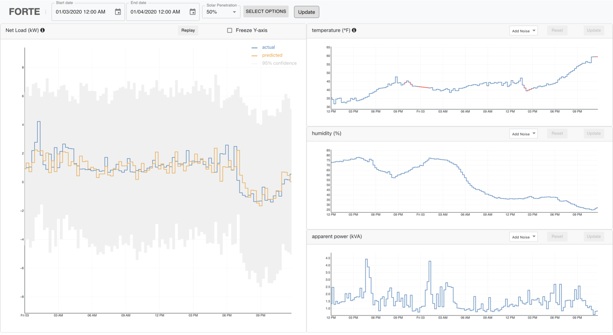
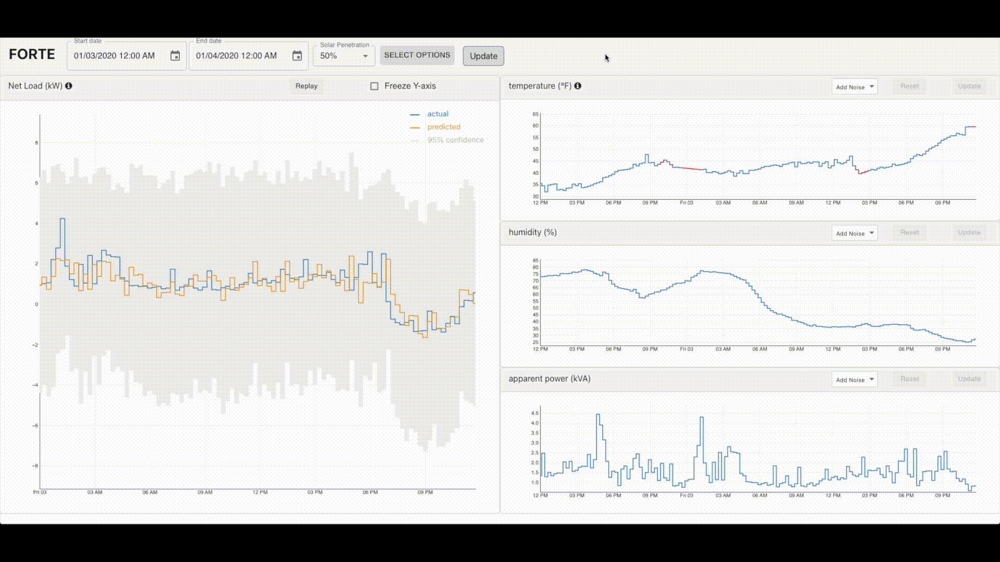

# About
Accurate net-load forecasting is vital for energy planning, aiding decisions on trade and load distribution. However, assessing the performance of forecasting models across diverse input variables, like temperature and humidity, remains challenging, particularly for eliciting a high degree of trust in the model outcomes. In this context, there is a growing need for data-driven technological interventions to aid scientists in comprehending how models react to both noisy and clean input variables, thus shedding light on complex behaviors and fostering confidence in the outcomes. In this paper, we present ``Forte``, a visual analytics-based application to explore deep probabilistic net-load forecasting models across various input variables and understand the error rates for different scenarios. With carefully designed visual interventions, this web-based interface empowers scientists to derive insights about model performance by simulating diverse scenarios, facilitating an informed decision-making process. We discuss observations made using `Forte`` and demonstrate the effectiveness of visualization techniques to provide valuable insights into the correlation between weather inputs and net-load forecasts, ultimately advancing grid capabilities by improving trust in forecasting models.

# Publication (arXiv version)
[Forte: An Interactive Visual Analytic Tool for Trust-Augmented Net Load Forecasting](https://arxiv.org/pdf/2311.06413.pdf)

# Steps to Run this project
1. Clone this project to your local machine
1. Download all the Python requirements using `python3 -m pip install -r requirements.txt`
1. Create a new folder for the Flas logs using `mkdir pyAPI/logs`
1. Type this command in your terminal `export FLASK_ENV=development` (For Powershell, use `$env:FLASK_APP = "pyAPI\app4.py"`)
1. Type this command: `export FLASK_APP=pyAPI/app4.py` (For Powershell, use `$env:FLASK_ENV = "development"`)
1. Next, run flask using `flask run`
1. Now open a different terminal and type this command to install the Node dependencies `npm install`
1. Now run the app using this command: `npm start`
1. Your app would be running at http://localhost:3000

# Interface

# Interface GIF

# Community guidelines
If you face any issues while running this project, please open an issue in this repo, and we will try to respond as soon as possible.
Feel free to contribute to this project by creating a fork or a branch on this repo. All ideas/improvements/suggestions are welcome!